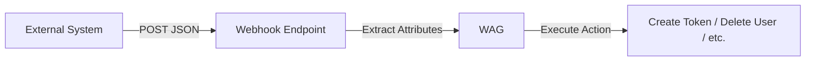

# Automation

Automate user and device lifecycle management in WAG using webhooks to trigger actions based on external events.

## Overview

The automation system allows you to integrate WAG with external services and workflows. By creating webhooks, you can automatically:

- Generate registration tokens for new users
- Provision or deprovision devices
- Remove users from the system
- Synchronize with your existing identity management systems

## How It Works

Webhooks act as HTTP endpoints that listen for incoming requests. When a webhook receives data, it extracts specific configurable attributes from the JSON payload and executes the configured action.



## Creating a Webhook

1. Navigate to **Automation** in the main menu
2. Click **Add Webhook**
3. Configure your webhook with the following:
  - **Action**: Choose the operation to perform (e.g., create token, delete user, delete device)
  - **JSON Attribute Mappings**: Map JSON fields from incoming requests to Wag attributes


::: warning Security Considerations
 `X-AUTH-HEADER` values are sensitive, and only displayed once. It is best practice to avoid checking these values in to version control, or any publicly accessible location as they can enable an attacker to access your system depending on what webhook it is configured for.
:::

Then either manually write in what JSON attributes map to what, or send a test request. 

e.g

```sh
curl -X POST --data '{"username": "a big tag", "token": "aaaaaaaaaaaaaaaaaaaaaaaaaaaaaaaaaaaaaaaaa"}' --header "X-AUTH-HEADER: 4b8edf348277edae613c56b98a51a464" http://127.0.0.1:80/webhooks/22a5b04aea51b40ab63f4511a28e5512
```

Results in:


### Attribute Mapping

When configuring a webhook, you define how incoming JSON data maps to Wag's internal attributes. This allows you to integrate with any system that can send JSON payloads.

**Example**: If your HR system sends:

```json
{
 "employee_email": "user@example.com",
 "department": "engineering",
 "employee_id": "EMP-12345"
}
```

You could map:
- `employee_email` → **username**


## Monitoring Webhooks


### Status Indicators

Each webhook displays its current status:

- **UNUSED** : Webhook has never received a request
- **OK** : Last request processed successfully 
- **ERROR**: Last request failed

### Inspecting Webhook Activity

Double-click any webhook or click the inspect icon to view:


- **Last Input Received**: Timestamp of the most recent request
- **Status**: Success or error state
- **Received JSON**: The complete payload from the last request


